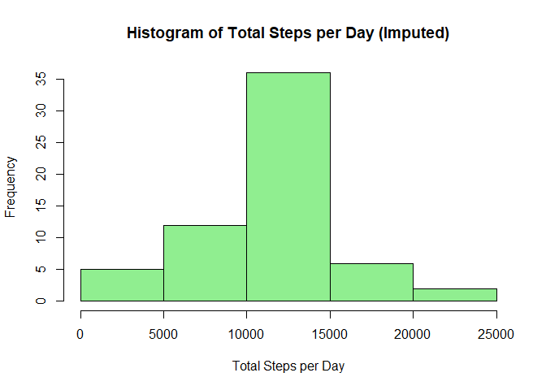

## Loading and Preprocessing

    # Load the data
    activity_data <- read.csv("activity.csv")

    # Display the first few rows of the dataset
    head(activity_data)

    ##   steps       date interval
    ## 1    NA 2012-10-01        0
    ## 2    NA 2012-10-01        5
    ## 3    NA 2012-10-01       10
    ## 4    NA 2012-10-01       15
    ## 5    NA 2012-10-01       20
    ## 6    NA 2012-10-01       25

## What is the mean total number of steps taken per day?

    # Calculate the total number of steps taken per day
    total_steps_per_day <- aggregate(steps ~ date, activity_data, sum, na.rm = TRUE)

    # Make a histogram of the total number of steps taken each day
    hist(total_steps_per_day$steps, main = "Histogram of Total Steps per Day",
         xlab = "Total Steps per Day", ylab = "Frequency", col = "skyblue", border = "black")

    # Calculate and report the mean and median of the total number of steps taken per day
    mean_steps_per_day <- mean(total_steps_per_day$steps)
    median_steps_per_day <- median(total_steps_per_day$steps)

    # Display mean and median
    mean_steps_per_day

    ## [1] 10766.19

    median_steps_per_day

    ## [1] 10765

    ## Including Plots

## What is the average daily activity pattern?

    # Calculate the average number of steps taken for each 5-minute interval across all days
    average_steps_per_interval <- aggregate(steps ~ interval, activity_data, mean, na.rm = TRUE)

    # Make a time series plot
    plot(average_steps_per_interval$interval, average_steps_per_interval$steps, type = "l",
         main = "Average Daily Activity Pattern", xlab = "5-Minute Interval", ylab = "Average Steps")

    # Find the 5-minute interval with the maximum average number of steps
    max_interval <- average_steps_per_interval[which.max(average_steps_per_interval$steps), ]

    # Display the interval with the maximum average number of steps
    max_interval

    ##     interval    steps
    ## 104      835 206.1698

## Inputing missing values

    # Calculate and report the total number of missing values in the dataset
    total_missing_values <- sum(is.na(activity_data$steps))

    # Display the total number of missing values
    total_missing_values

    ## [1] 2304

    # Devise a strategy for filling in missing values (e.g., using mean for each 5-minute interval)
    fill_missing_values <- function(df) {
      df$steps[is.na(df$steps)] <- mean(df$steps, na.rm = TRUE)
      return(df)
    }

    # Apply the strategy to create a new dataset with filled-in missing values
    activity_data_imputed <- fill_missing_values(activity_data)

    # Make a histogram of the total number of steps taken each day for the imputed dataset
    total_steps_per_day_imputed <- aggregate(steps ~ date, activity_data_imputed, sum)

    hist(total_steps_per_day_imputed$steps, main = "Histogram of Total Steps per Day (Imputed)",
         xlab = "Total Steps per Day", ylab = "Frequency", col = "lightgreen", border = "black")

    # Calculate and report the mean and median of the total number of steps taken per day for the imputed dataset
    mean_steps_per_day_imputed <- mean(total_steps_per_day_imputed$steps)
    median_steps_per_day_imputed <- median(total_steps_per_day_imputed$steps)

    # Display mean and median for the imputed dataset
    mean_steps_per_day_imputed

    ## [1] 10766.19

    median_steps_per_day_imputed

    ## [1] 10766.19

    # Compare the estimates before and after imputing missing data
    comparison_df <- data.frame(
      Metric = c("Mean Steps per Day", "Median Steps per Day"),
      Original = c(mean_steps_per_day, median_steps_per_day),
      Imputed = c(mean_steps_per_day_imputed, median_steps_per_day_imputed)
    )

    comparison_df

    ##                 Metric Original  Imputed
    ## 1   Mean Steps per Day 10766.19 10766.19
    ## 2 Median Steps per Day 10765.00 10766.19

## Are there differences in activity patterns between weekdays and weekends?

    # Create a new factor variable indicating whether a given date is a weekday or weekend day
    activity_data_imputed$day_type <- ifelse(weekdays(as.Date(activity_data_imputed$date)) %in% c("Saturday", "Sunday"), "weekend", "weekday")

    # Calculate the average number of steps for each 5-minute interval, grouped by day type
    average_steps_per_interval_day_type <- aggregate(steps ~ interval + day_type, activity_data_imputed, mean)

    # Make a panel plot containing a time series plot for weekday and weekend activity patterns
    library(ggplot2)

    ggplot(average_steps_per_interval_day_type, aes(x = interval, y = steps)) +
      geom_line(aes(group = day_type, color = day_type)) +
      labs(title = "Average Daily Activity Pattern by Day Type",
           x = "5-Minute Interval", y = "Average Steps") +
      scale_color_manual(values = c("weekday" = "blue", "weekend" = "red")) +
      theme_minimal()

